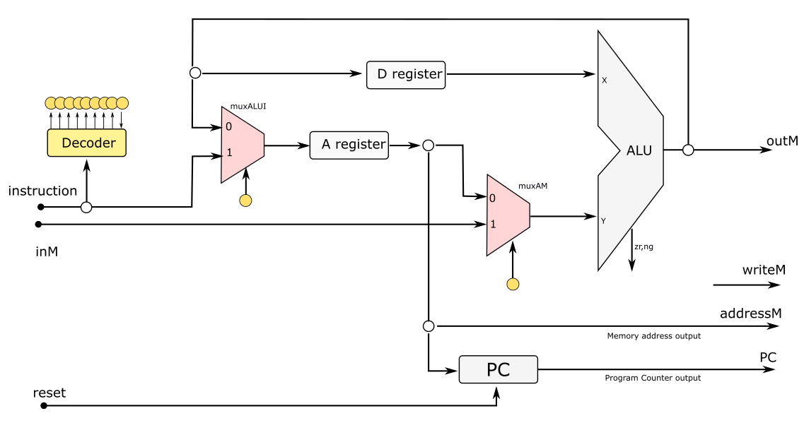

# Av3 - 2° Semestre de 2021


Avaliação 3 - Elementos de Sistemas

| Pontos HW    | Pontos SW      |
| :--------:   | :--:           |
|   30         |  40            |

- Avaliação **individual**.
- **100 min** total.
- Ficar conectado no canal geral no Teams (para ouvir instruções).
- Ficar no blackboard durante a prova.
- Clonar o seu repositório (e trabalhar nele)
- Fazer **commit** ao final de cada questão.
- Lembre de dar **push** ao final.


As questões de hardware (`.vhd`) devem ser implementadas nos arquivos localizados na pasta `src/vhd`, as questões de software (`nasm`) devem ser implementadas nos arquivos localizados em `src/nasm`. Os scripts a seguir testam respectivamente a parte de hardware e software:

```
./testeHW.py
./testeAssembly.py
```

> Vocês devem editar o arquivo `config_testes.txt` selecionando o que desejam testar.

**LEMBRE DE REALIZAR UM COMMIT (A CADA QUESTÃO) E DAR PUSH AO FINALIZAR**


## 1. Separação de bits

| Pontos HW    | Pontos SW      |
| :--------:   | :--:           |
|   0          |  15            |

Considere o nosso computador Z01.1 será usado para o processamento de uma imagem em escala de cinza, que estará armazenada na memória a partir da posição RAM\[10\]. A profundidade de cada pixel da imagem é representada por 8 bits, de forma que cada posição de memória possui o valor da profundidade de 2 pixels. Por exemplo, a RAM\[10\] armazena os valores dos 2 primeiros pixels da imagem.

No entanto, para processar a imagem, deseja-se separar os pixel em posições diferentes da memória. Assim, crie um programa em Assembly que leia a posição 10 da memória RAM e separa o seu conteúdo da seguintes forma:

- Os bits 7 a 0 devem ser copiados para a RAM\[0\].
- Os bits 15 a 8 devem ser copiados para a RAM\[1\].
- Os demais bits da RAM\[0\] e RAM\[1\] devem permanecer em '0'.

#### Exemplo:

Valor inicial da memória:

RAM\[10\] = 'xxxxxxxxyyyyyyyy'

Resultado:

RAM\[0\] = '00000000yyyyyyyy'

RAM\[1\] = 'xxxxxxxx00000000'


### Implementação

Implemente as funções lógicas para as saídas no arquivo `src/nasm/separacao.nasm`

#### Rubrica para avaliação:

| Pontos HW    | Descritivo     |
| :--------    | :--            |
|   15         |  Função implementada e funcionando  (implementação passa em todos os testes)    |
|   5          |  Cópia realizada sem selecionar os bits (passa nos dois primeiros testes) |


## 2. Sequência de Fibonacci

| Pontos HW    | Pontos SW      |
| :--------:   | :--:           |
|   0          |  15            |

A sequência de Fibonacci é uma sequência de números inteiros, onde cada termo subsequente corresponde à soma dos dois termos anteriores. A sequência normalmente começa com "0" e "1" e tem aplicações em diversas áreas como mercado financeiro, ciências da computação e fenômenos da natureza.

Crie um programa em Assembly que escreva os 11 primeiros números da sequência de Fibonacci na memória RAM entre as posições RAM\[10\] e RAM\[20\], começando com RAM\[10\] = "0" e RAM\[11\] = "1".

#### Exemplo:

RAM\[10\] = '0000000000000000'

RAM\[11\] = '0000000000000001'

RAM\[12\] = '0000000000000001'

RAM\[13\] = '0000000000000010'

e assim suscessivamente.

### Implementação

Implemente as funções lógicas para as saídas no arquivo `src/fibonacci.nasm`


#### Rubrica para avaliação:

| Pontos HW    | Descritivo     |
| :--------    | :--            |
|   15         |  Sequência criada com uso de saltos   |
|   5          |  Sequência criada sem uso de saltos   |


## 3. CPU modificada

| Pontos HW    | Pontos SW      |
| :--------:   | :--:           |
|   20         |  0             |

Pretende-se fazer uma modificação na CPU de forma a alterar a posição do MuxALUI permitindo que um valor seja carregado tanto no registrador %A como no %D ou em ambos em um mesmo ciclo. A figura a seguir ilustra a modificação:


Assim, o formato das instruções, que permanece usando 18 bits, deve ser alterado. Os dois bits mais significativos passam a indicar o tipo de instrução da seguinte forma:

- "00" - carregamento no registrador %A (leaw $valor, %A)
- "01" - carregamento no registrador %D (leaw $valor, %D)
- "10" - instrução tipo C (demais operações)
- "11" - carregamento em ambos os registradores %A e %D. (leaw $valor, %A, %D)

### Implementação

Implemente no arquivo `vhd/controlUnit3.vhd` os sinais de controle do MuxALUI e dos sinais de load dos registradores %A e %D.

> Os sinais de load devem considerar tanto a operação de leaw como as demais instruções tipo C, assim como no CPU montado no projeto F.


#### Rubrica para avaliação:

| Pontos HW    | Descritivo     |
| :--------    | :--            |
|   20         |  As três fuções implementadas e funcionando   |
|   10         |  Apenas o controle do MuxALUI implementado e funcionando    |
|   5          |  Apenas o load de um registrador implementado e funcionando |


## 4. CPU - instrução

| Pontos HW    | Pontos SW      |
| :--------:   | :--:           |
|   10         |  10            |

Considere que a instrução

"100000011010010001"

seja aplicada a nossa CPU feita em aula e representada na figura a seguir.



> A instrução não corresponde a nenhum OpCode Assembly utilizado antes!

Sabendo que os valores armazenados nos registradores %A e %D antes da execução da instrução acima são:

- Reg_A: "0000000000000000"
- Reg_D: "0111111111111111"


### a)

Determine o valor na saída da ULA e nos registradores %D e %A imediatamente após o processamento da instrução.

Escreva sua resposta nos respectivos campos do arquivo `vhd/questao5.txt`.

### b)

Quais são as linhas em Assembly que efetuariam a mesma operação dessa nova instrução?

Escreva sua resposta no respectivo campo do arquivo `vhd/questao5.txt`.


#### Rubrica para avaliação:

| Pontos HW    | Pontos SW    | Descritivo     |
| :--------    | :--          | :--            |
|   10         |  0           | Item a   |
|    0         |  10          | Item b   |
